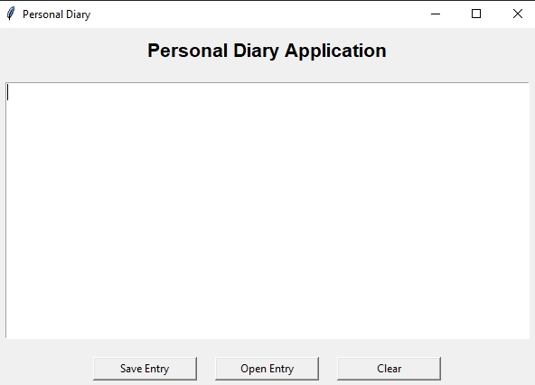
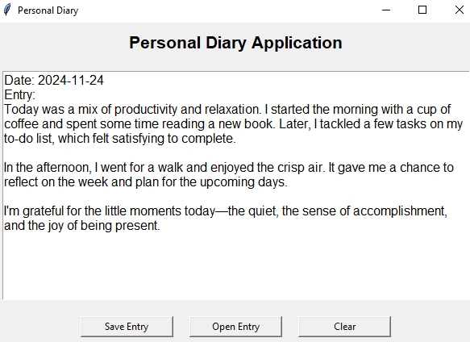

# Personal Diary Application

A simple and intuitive desktop application for writing, saving, and viewing daily diary entries. The app provides a clean interface for recording thoughts, experiences, or plans.

## Features

- **Write Entries**: Use the multiline text editor to write diary entries.
- **Save Entries**: Save your diary entries as `.txt` files with a timestamp.
- **Open Entries**: Load previously saved diary entries for review or editing.
- **Clear Editor**: Clear the text editor to start fresh.

## How to Use

1. Open the application.
2. Write your diary entry in the provided text box.
3. Use the following buttons:
   - **Save Entry**: Save your current entry to a file.
   - **Open Entry**: Open and view previously saved entries.
   - **Clear**: Erase the current content in the text box.

## Screenshots

### Main

### 
